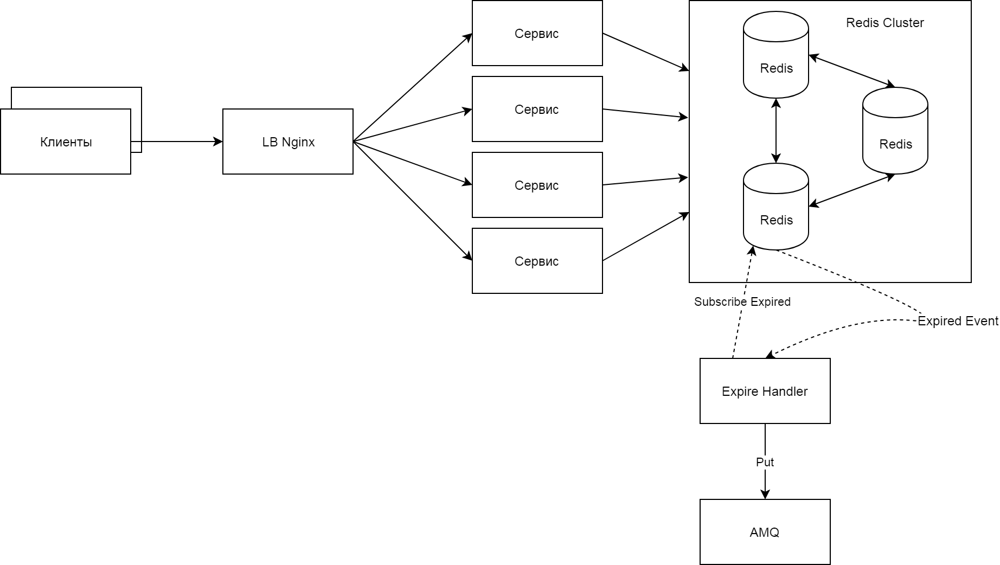

# Example Cache service

### REST API
- GET /cache/{key}  - Get the value (@RequestBody) of key.
- PUT, POST /cache/{key} - Set key to hold the value (@RequestBody). Parameter "expiry" is used to define TTL in cache (seconds). After expiration, value will be sended to AMQ.
- DELETE /cache/{key} - Remove the specified key

### Requirements
- Redis 3
- Active MQ 5
- java 1.8.131 (min)

### Run
gradlew bootRun

### Architecture

